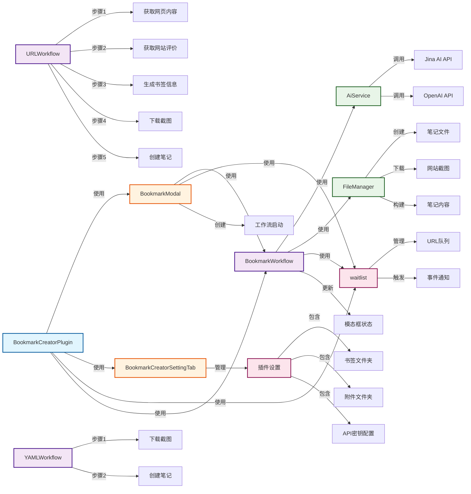

# Obsidian书签创建器插件 - 代码结构文档

## 概述
本文档描述了Obsidian书签创建器插件的代码结构，包括所有函数、对象、方法及其调用关系。

## 文件结构
```
src/
├── ApiCaller.ts      # AI服务调用
├── FileManager.ts    # 文件管理
├── main.ts          # 插件主入口
├── modal.ts         # 模态框管理
├── settings.ts      # 设置管理
├── steps.ts         # 步骤定义
├── types.ts         # 类型定义
├── waitlist.ts      # 等待队列管理
└── workflow.ts      # 工作流管理
```

## 类和方法分析

### 1. ApiCaller.ts - AI服务类
#### AiService类
- **callApi(url, type, siteInfo)** - 调用AI API
  - 验证服务类型和API密钥
  - 处理JinaReader、JinaSearch、OpenAI三种服务
  - 返回处理后的内容
- **generateBookmarkYaml(url, webContent, searchInfo)** - 生成书签YAML
  - 构建提示词并调用OpenAI API
  - 返回生成的YAML内容

### 2. FileManager.ts - 文件管理类
#### FileManager类
- **ensureFolderExists(folderPath)** - 确保文件夹存在
- **sanitizeFileName(fileName)** - 清理文件名
- **ensureFileCanBeCreated(filePath)** - 确保文件可创建
- **createNoteFile(title, content)** - 创建笔记文件
- **downloadScreenshot(url, noteTitle)** - 下载网站截图
- **buildNoteContent(data)** - 构建笔记内容

### 3. main.ts - 插件主类
#### BookmarkCreatorPlugin类
- **onload()** - 插件加载初始化
  - 加载设置
  - 添加命令
  - 注册URI处理
  - 添加设置页面
- **onunload()** - 插件卸载清理
- **loadSettings()** - 加载插件设置
- **saveSettings()** - 保存插件设置
- **registerURI()** - 注册URI处理

### 4. modal.ts - 模态框类
#### BookmarkModal类
- **inputMode()** - 切换到输入模式
- **progressMode(full, title)** - 切换到进度模式
- **updateStepStatus(stepName, status)** - 更新步骤状态
- **startProgressTimer()** - 启动进度定时器
- **stopCurrentProgressTimer()** - 停止进度定时器
- **createStyle()** - 创建样式
- **createInputArea()** - 创建输入区域
- **createButtonArea()** - 创建按钮区域
- **startWorkflow()** - 启动工作流
- **setCreatedNotes(notes)** - 设置成功创建的笔记
- **updateButtonStates()** - 更新按钮状态
- **openAllNotes()** - 打开所有笔记
- **handleCancel()** - 处理取消操作

### 5. settings.ts - 设置管理
#### DEFAULT_SETTINGS - 默认设置常量
#### BookmarkCreatorSettingTab类
- **display()** - 显示设置页面
- **createBookmarkFolderSetting()** - 创建书签文件夹设置
- **createAttachmentFolderSetting()** - 创建附件文件夹设置
- **createJinaApiKeySetting()** - 创建Jina API密钥设置
- **createAiApiBaseUrlSetting()** - 创建AI API基础URL设置
- **createAiApiModelSetting()** - 创建AI API模型设置
- **createAiApiKeySetting()** - 创建AI API密钥设置
- **createAiPromptTemplateSetting()** - 创建AI提示词模板设置
- **createUsageInstructions()** - 创建使用说明
- **createAiFeatureInstructions()** - 创建AI功能说明
- **createYamlExample()** - 创建YAML示例

### 6. steps.ts - 步骤定义
#### 步骤定义
- **allSteps** - 所有步骤数组
  - get-web-content: 获取网页内容
  - get-web-rating: 获取网站评价
  - generate-bookmark-info: 生成书签信息
  - download-web-screenshot: 下载网站截图
  - create-bookmark-note: 创建书签笔记
- **steps** - 步骤集合（full和simple）
- **statusIcons** - 状态图标映射

### 7. types.ts - 类型定义
#### 接口定义
- **BookmarkCreatorSettings** - 插件设置接口
- **siteInfoObj** - 网站信息对象
- **NoteContentData** - 笔记内容数据
- **WorkflowCancellationError** - 工作流取消异常类

#### 类型定义
- **AiServiceType** - AI服务类型
- **modalType** - 模态框类型
- **stepStatus** - 步骤状态类型

### 8. waitlist.ts - 等待队列管理
#### WaitlistManager类
- **add(url, type)** - 添加项目到队列
- **read(n)** - 读取第n个元素
- **remove()** - 删除第一个元素
- **clear()** - 清空队列
- **update(step, status, n)** - 更新状态
- **subscribe(event, listener)** - 订阅事件
- **unsubscribe(event, listener)** - 取消订阅事件

### 9. workflow.ts - 工作流管理
#### BookmarkWorkflow类
- **startURLWorkflow()** - 启动URL工作流
- **startYAMLWorkflow(yamlContent)** - 启动YAML工作流
- **URLWorkflow(url, currentIndex)** - 执行URL工作流步骤
- **executeStep(stepId, stepFunction)** - 执行工作流步骤
- **parseGeneratedYaml(yamlContent)** - 解析生成的YAML
- **createBookmarkNote(noteData)** - 创建书签笔记
- **requestCancellation()** - 请求取消工作流
- **shouldCancel()** - 检查是否应该取消
- **resetCancellationState()** - 重置取消状态

## 调用关系图



## 核心流程

### 1. 插件启动流程
1. `BookmarkCreatorPlugin.onload()` 加载设置和命令
2. 注册 `创建书签笔记` 命令
3. 用户触发命令时创建 `BookmarkModal`

### 2. URL工作流流程
1. 用户在模态框输入URL
2. `BookmarkModal.startWorkflow()` 启动工作流
3. `BookmarkWorkflow.startURLWorkflow()` 处理队列
4. 依次执行：获取内容 → 获取评价 → 生成书签 → 下载截图 → 创建笔记

### 3. YAML工作流流程
1. 用户输入YAML格式内容
2. `BookmarkWorkflow.startYAMLWorkflow()` 处理
3. 依次执行：下载截图 → 创建笔记

### 4. 状态管理
- 使用 `waitlist` 管理待处理URL队列
- 使用步骤状态系统跟踪处理进度
- 模态框实时显示处理状态和进度

## 关键特性

1. **双模式支持**：支持URL自动处理和YAML手动输入
2. **批量处理**：支持多个URL的批量处理
3. **状态跟踪**：实时显示每个步骤的处理状态
4. **取消机制**：支持工作流中途取消
5. **错误处理**：完善的错误处理和用户提示
6. **设置管理**：完整的插件设置界面